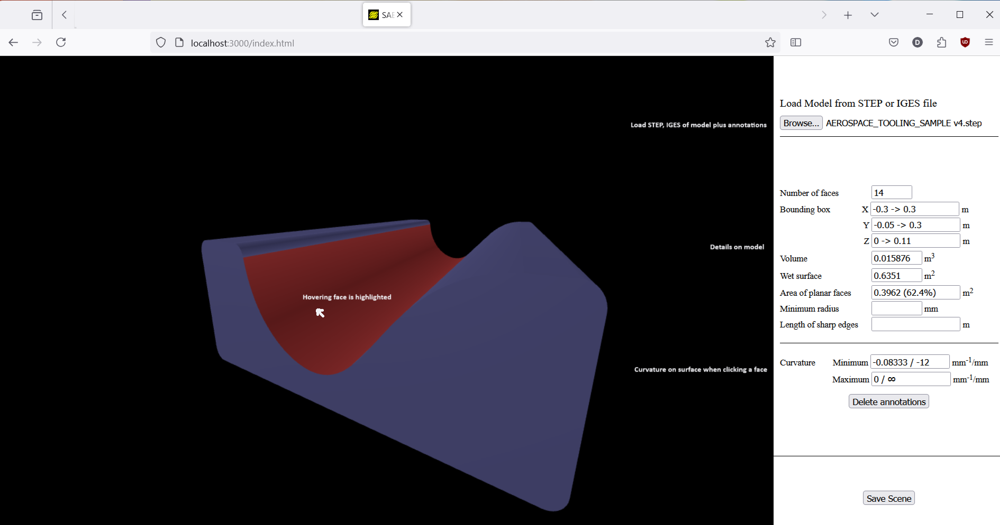
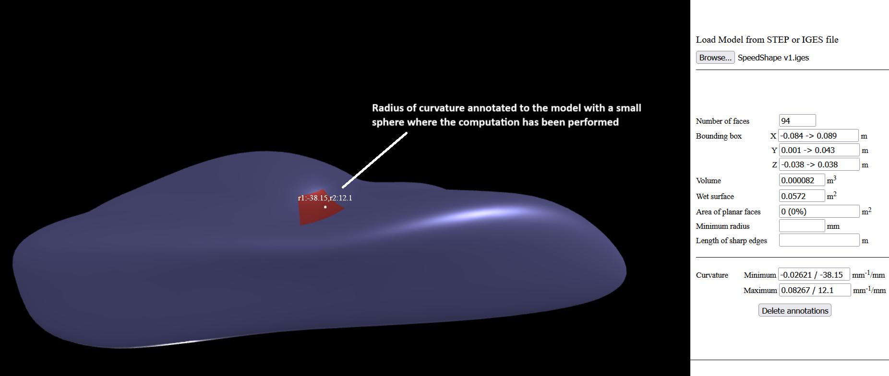

# View an annotate, in a web browser, STEP and IGES models

This prototype uses the following technologies:  
* Node.js to develop and reuse javascript libraries,
* OpenCascade js (javascript binding of OpenCascade), using WebAssembly to download large libraries and allow the client to run complex code,
* Three.js, javascript library ontop of WebGL to visualize meshes in the browser in connection with the graphic card. 

The advantage of this approach, compare to a solution where the model is uploaded and processed remotly, is to allow interactions. But the downside might be the performances considering the necessary resources (CPU and memory) to visualize and process (complex) models.
  
This protoype ignores somewho performance issues that should be (in real life) poroperly investigated.  

The priority has been given to feature implementation vs. code quality. The code comes originaly from OpenCascade JS samples and has been enriched of specific features (quality of rendering, face selection, model characterisation, curvation computation and display...).

## Install dev environment  
apt-get update  
apt install npm  
npm install -g npm  
apt install nodejs  
npm install opencascade.js@beta  
npm i npx  

## Build the application  
npm i  
npm install -D webpack-cli  
npx webpack --config webpack.config.js  

## Launch the server:  
npm run start  

## Access the service in the web browser:  
If the browser is running on the same host as the server, the url of the service should be:  
http://localhost:3000/index.html  

If the browser is running on a different host and the server has a reachable ip, the url of the service should be:  
http://\<server ip\>:3000/index.html 

## User guide

> Click the button "Browse..." to open and visualise a STEP or IGES model stored on a local disk.  
* most of the text boxes (except minimum radius and edge sharpness because of lack of time) at the right are filled with model characteristics (number of faces, mass properties, ),  
* the tesselated representation of the model (meshs) are displayed in a black canvas, the view can me modified (zoom in and out: two fingers on the touch pad or wheel, rotation: left click and mouse move, translate: shift or control + left click), 
* the face under the mouse pointer is highlighted in red.   
  
  
  
> Left click on any face of the model to compute the curvatures (min and max) on the surface where the click has hit the surface.  
* the bottom left text boxes are filled with the curvature values (and the inverses, i.e. the radii) that have been computed.  
  
> Left click <b>with Ctrl key pushed</b> on any face of gthe model to compute the curvatures (min and max) on the surface where the click has hit the surface and create an 2D/3D annotation. 
* a 2D text, made of both radii of curvature, is inserted in the 3D scene,
* a tiny sphere located at the hit point is also inserted in the 3D scene.  
 

  
> Click the button "Delete annotations" to remove all annotations from the scene. 
* All 2D texts and all tiny spheres are not visiblke anymore.

> Click the button "Save Scene" to store locally the model and all the created annotation.
* The created file will be save in the Download folder associated with the web browser,  
* The name of the created file has the same name as the input model with the extension replaced with '.saeki' extension. 
  
> Click the button "Browse..." and select a .saeki file that has been previously saved.  
* The model with be visualised in the 3D canvas,  
* The annotations will be recreated as they were when the file has been stored.  